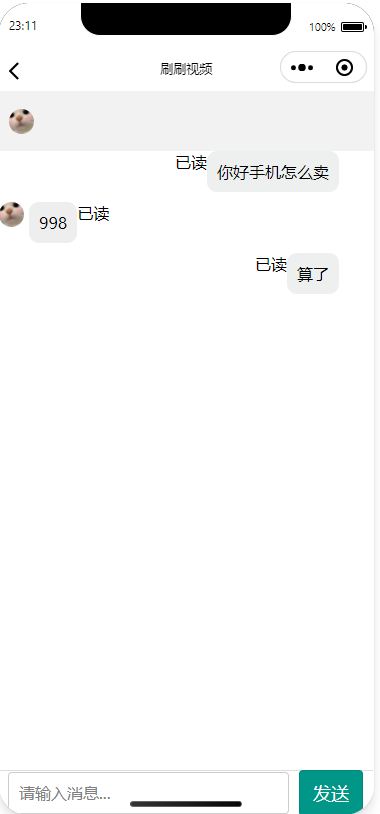

#抖音短视频微信小程序版
简介：简介随着微信的普及，小视频的流行，我设计一款基于微信小程序端的视频社交软件 + 后台管理系统作为自己毕业设计----抖音-微信小程序端（短视频社交小程序，用户可以在小程序上发布自己的短视频 并且经过我们的平台加入滤镜或者背景音乐制作出独具特色的短视频。还可以上传商品，购买商品
并实现了点赞、评论、下载、分享、转发等功能的小程序）抖音小程序---的后台管理系统，主要实现了人员的管理，短视频的管理，商城的管理，数据可视化，背景音乐的管理，登陆注册，权限验证，单点登陆等等。 从需求分析，功能设计，前端到后台，再到数据库的设计。一点点的积累，一点点的完善，预计小程序端+后台管
理系统开发周期一个月(每天更新)。 对一个开发人员来说，如果想单纯的做出这些功能，其实并不难。 难的是对于这些功能细节的把控，项目整体的友好程度，用户的体验效果；对并发的考虑，对恶意请求，对流畅度这些细节的考虑等等。
<h2>前台-小程序端效果展示</h2>

  

 
<h2>后台管理系统页面展现</h2>

<h2>关键字：springboot、分布式、前后分离</h2>

<h2>相关技术 </h2>
 
前端:h5+css+javascript+jquery+bootstrap+themeleaf+ H plus

 
后端:springcloud+springboot+sping+springmvc+mybatis+mysql+redis+shiro

 
组件:bootsrap-table,webUploader,pagehelper+layer

 
项目部署: docker + linux

 
中间件:eureka(微服务治理)

 
消息队列: rabbitmq

 
测试:swagger2

 
开发风格：分布式系统架构，前后分离开发风格，RESTful api

<h2>代码介绍 </h2>

scetc-show-videos-admin 后台管理系统

scetc-show-videos-cloud eureka服务发现与注册

scetc-show-videos-config 分布式配置中心

scetc-show-videos-dev 小程序后台

scetc-show-videos-page 小程序界面

 <h2>需求分析</h2>
 
用户需求
 
 
用户个人信息管理，视频的编辑（加入滤镜或者背景音乐）、上传、浏览、点赞、关注、下载、等功能。

 
管理员需求

 
系统管理员的需求为：用户管理（新增用户、删除用户及用户登录系统数据的初始化操作）、视频管理（视频分类、新增视频、对违违法视频进行删除操作）、背景音乐管理（对音乐库中音乐的增删改查）、滤镜管理（滤镜的增改）、用户管理（新增各权限级的管理员、删除管理员、对子集权限组管理员系统登录数据的初始化操作）以及消息通知（发布不同对象的系统消息、对所有消息进行查看及删除操作）
 
